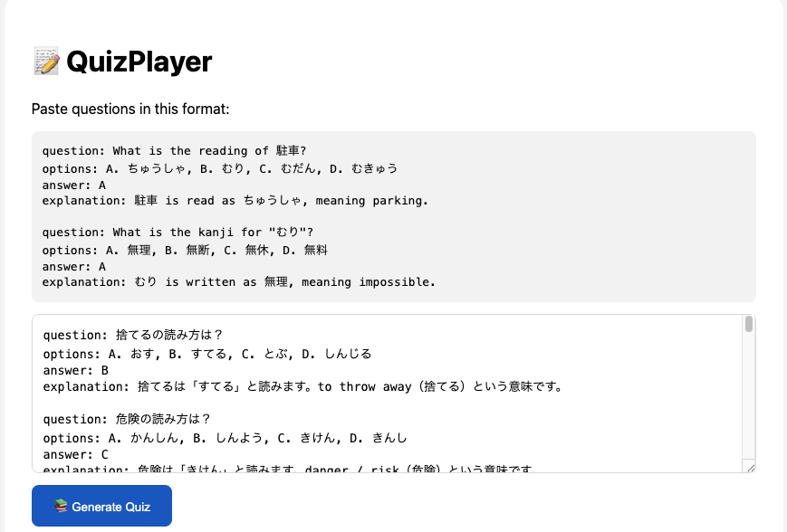
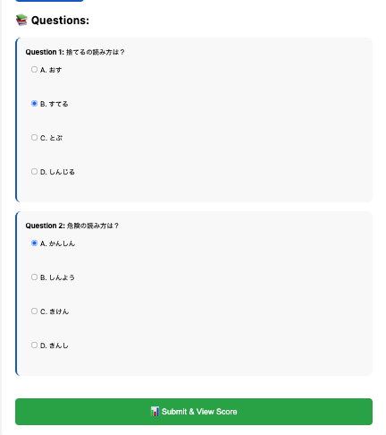
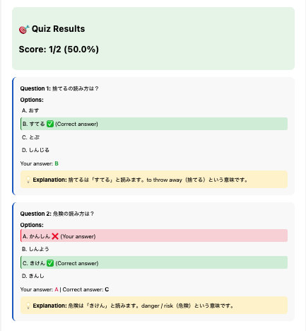

# 📝 QuizPlayer

Import questions from AI (DeepSeek/ChatGPT), answer multiple choice questions, view scores and explanations.

## Features

✅ Paste questions in the format question: ... answer: ... explanation: ...  
✅ Automatically generate quizzes with options A, B, C, D  
✅ Select answers, submit, and view your score  
✅ Display correct/incorrect answers + explanations

## How to Use

1. Ask AI to create questions in this format:
question: 捨てるの読み方は？
options: A. おす, B. すてる, C. とぶ, D. しんじる
answer: B
explanation: 捨てるは「すてる」と読みます。to throw away（捨てる）という意味です。

2. Click "Generate Quiz"



3. Answer the questions and submit



4. View the score and explanation



## How to Run

```bash
go run main.go
Open http://localhost:8080